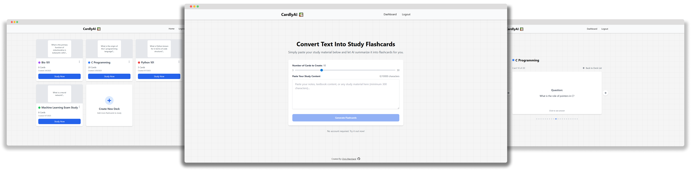

# CardlyAI

## What is CardlyAI?

CardlyAI uses a large language model to summarise and convert key concepts from input text, into concise and informative study flashcard to help students study. These generated flashcards can then be used in the study mode where the question is presented on one side of the card, and the answer can be revealed by flipping over the card.

## Key Features

- **Instant AI Flashcard Generation** - Paste any text and get quality flashcards in seconds.
- **Free Guest Access** - No account required to start creating flashcards.
- **Interactive Study Mode** - Practice using your cards with the interactive study mode.
- Editable Decks - Cards in decks can be edited, added, or deleted.

## How to Use CardlyAI

   

1. Visit [CardlyAI](https://cardly-ai.vercel.app/")
2. Paste Your Content
    - Copy and paste text from your notes, textbooks or lectures into the textbox.
3. Choose Your Deck Settings
    - Choose the name, colour and how many flashcards to generate (3 - 50) for your deck.
4. Generate & Study
    - Click "Generate Flashcards" and start studying once your deck has been created.
    - Use the arrow keys to navigate between cards.
    - Left click or press Space to flip between question and answer.

    - Create

## Tips for Best Results

- **Quality Input = Quality Output**: Provide clear, well-structured text for better flashcards
- **Optimal Length**: 300-10,000 characters allows the AI enough context to effectively generate flashcards
- **Review and Edit**: Quickly review and edit generated cards if needed.

## See Live
[**Try CardlyAI**](https://cardly-ai.vercel.app/) - No account required to start generating flashcards!
